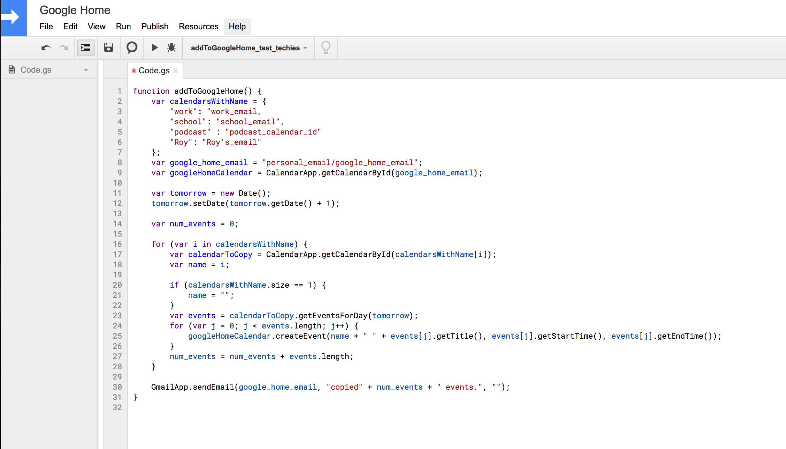
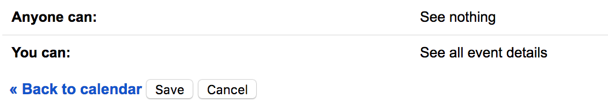
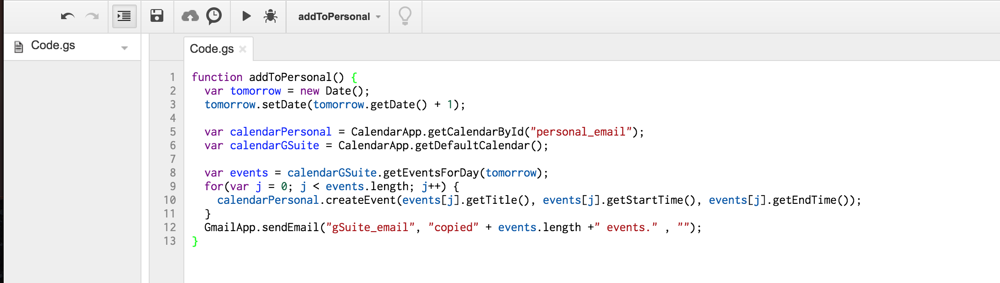
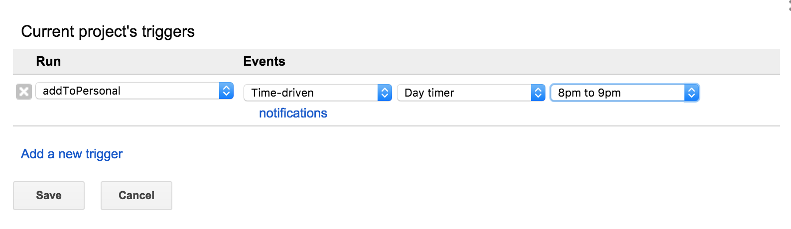

Google home does not work with G Suite yet. Also it does not allow one to use multiple calendar. This aims to bring these capabilities in a dummy fashion by copying over calendar entries.

# Table of Contents
1. [Use multiple calendars (including Gsuite)](#Use-multiple-calendars) : Recommended
2. [Use Gsuite calendar](#Using-GSuite-calendar) : Deprecated

## Use multiple calendars

**Copy various calendars to to your google home calendar.**

It makes a copy of each calendar entry with the title and start and end times. Other things like guests, creator etc are not copied over. Further on completion it sends you an email with the number of events created. 

It also adds a user customizable name to each calendar. So, yes you cannot say "hey Google what's on Mark's calendar" but when you ask Google what's on your calendar it will respond with "Mark - pick up Amanda from School.  Julia - Call mom".

**How to use** 

1) The account you are using google home with should be a standard @gmail account. 

1) The script needs to be written from GSuite calendar. 

2) Give access of you Google Home calendar to your GSuite account. To do that, follow the instructions over [here](https://support.google.com/calendar/answer/37082?hl=en-GB). Provide "Make changes to events" permission. This is **required** to create events.


3) Go to [apps script page](https://script.google.com/intro). **Make sure you are logged in with your G Suite account.**

4) Copy the contents of [google_home_mutiple_calendars.txt](google_home_mutiple_calendars.txt)  and paste them over in the editor shown. 




5) Change calendarsWithName variable with appropriate name and email addresses/calendar id. The name will be what you want to be saved in your google home calendar and the id of the calendar can be found by following the instructions over [here](https://docs.simplecalendar.io/find-google-calendar-id/).
    *  Most of the times the id of the calendar is same as the email of the person calendar belongs to, but sometimes calendars dont belong to one person, then it can be different. 
    *  An example of the variable is :

        ```
        var calendarsWithName = {
            "work": "work@work.com",
            "school": "school@school.com",
            "Mark" : "mark@gmail.com",
            "tech_podcast" : "tech_podcast@podcast.com"
        };
        ```


**Make sure all these calendars are shared with your GSuite account.**  To share a calendar follow the instructions over [here](https://support.google.com/calendar/answer/37082?hl=en-GB) . Give "See All Event Details Permissions". 

If the calendar is not yours/you can't share the calendar, check if your GSuite calendar already has "See All Event Details" Permissions. Most of the times this will already be there. You can check this by going to calendar settings of that calendar. It will look like this at the bottom of the page.



6) Change google_home_email variable to your google home email address. 

7) Go to Resources -> Current project triggers and add a trigger. Add a timer trigger, for the script to run once in a day. For example, I have set it to run everyday between 8 and 9 pm. It will copy tomorrow's event in this run.  Choose a time suitable for you. 

 

**Please note that if you run this script multiple times in a day, it will create duplicate calendar events i.e. this is not a smart script. Hence choose whatever time suits you the best**

8) Provide all permissions the script needs. It should require the following permissions:

 - View and manage your email. This is for it to send an email after it is done running.  
 - Manage your calendar. This is for it to read the calendar events. 

9) That's it. 


## Using GSuite calendar
**I would use the above method for G Suite also. It gives much more flexibility. This method is here as I started out with this and some people might still be using it.**

Copy calendar from Google suite calendar to your personal calendar.

Google home as of now does not work with Google suite account. This is a work around for that. 

It makes a copy of each calendar entry with the title and start and end times. Other things like guests, creator etc are not copied over. Further on completion it sends you an email with the number of events created. 

**How to use** 

1) Give access of your personal calendar to your Gsuite calendar. To do that, follow the instructions over [here](https://support.google.com/calendar/answer/37082?hl=en-GB). Provide "Make changes to events" permission. This is required to create events.

2) Go to [apps script page](https://script.google.com/intro). **Make sure you are logged in with your G Suite account.**

2) Copy the contents of [gSuite_to_personal.txt]( 	gSuite_to_personal.txt)  and paste them over in the editor shown. 

 

3) Change personal_email to your personal email address and GSuite_email to your GSuite email address. 

4) Go to Resources -> Current project triggers and add a trigger. Add a timer trigger, for the script to run once in a day. For example, I have set it to run everyday between 8 and 9 pm. It will copy tomorrow's event in this run.  Choose a time suitable for you. 

 

**Please note that if you run this script multiple times in a day, it will create duplicate calendar events i.e. this is not a smart script. Hence choose whatever time suits you the best**

5) Provide all permissions the script needs. It should require the following persmissions:

 - View and manage your email. This is for it to send an email after it is done running.  
 - Manage your calendar. This is for it to read the calendar events. 

6) That's it. 

